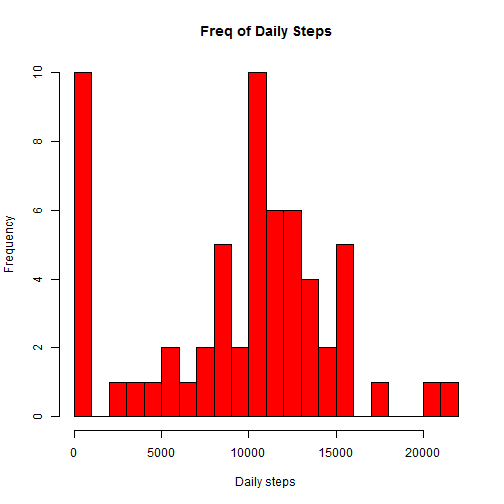
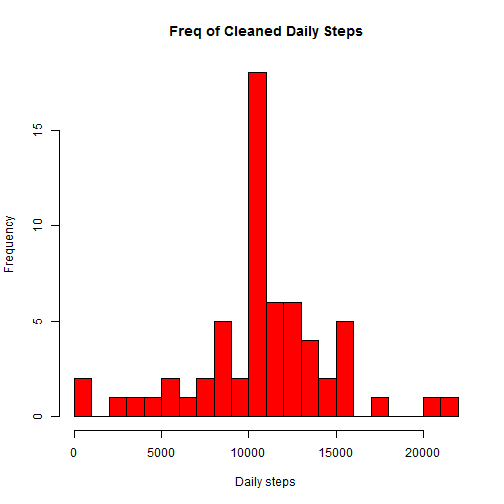
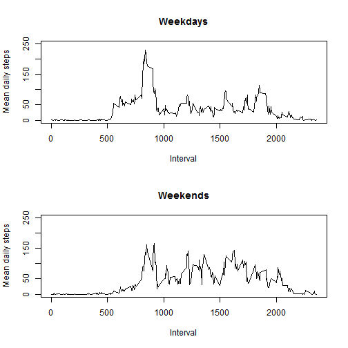

# Reproducible Research: Peer Assessment 1


## Loading and preprocessing the data
### load DF

```r
DF <- read.csv("activity.csv")
```


### clean date

```r
DF$DateGood <- as.Date(DF$date)
```


## What is mean total number of steps taken per day?
### Sum steps per day

```r
DailySteps <- as.vector(by(DF$steps, DF$DateGood, function(x) sum(x, na.rm = TRUE)))
```


### make the histogram

```r
hist(DailySteps, breaks = 20, xlab = "Daily steps", col = "red", main = "Freq of Daily Steps")
```

 


### mean + median

```r
MeanMedianSteps <- data.frame(mean = mean(DailySteps), median = median(DailySteps))
MeanMedianSteps
```

```
##   mean median
## 1 9354  10395
```


## What is the average daily activity pattern?

### Calc the ave steps + 5MIN intervals

```r
AveStepsTaken <- as.vector(by(DF$steps, DF$interval, function(x) mean(x, na.rm = TRUE)))
MinuteIntervals <- levels(as.factor(DF$interval))
```


### make the plot

```r
plot(MinuteIntervals, AveStepsTaken, type = "l", col = "red", xlab = "5 min Interval number", 
    ylab = "Ave number daily steps", main = "5-minute interval + average number steps taken, averaged across all days")
```

 


### find interval with max steps

```r
MaxInterval <- as.numeric(MinuteIntervals[which.max(AveStepsTaken)])
MaxInterval
```

```
## [1] 835
```

### Combine ave steps and 5minintervals

```r
DFX <- data.frame(MinuteIntervals, AveStepsTaken)
```

### NUmber steps in MaxInterval

```r
DFX[(MinuteIntervals == MaxInterval), ]
```

```
##     MinuteIntervals AveStepsTaken
## 104             835         206.2
```


## Imputing missing values

### for intervals with NA I am going to replace NA with the average steps for that 5-minute interval
### Calc # rows with NA

```r
NaRowsCount <- nrow(DF[is.na(DF$steps), ])
NaRowsCount
```

```
## [1] 2304
```


### Create a new data set with missing data replaced, i call it DFClean
### Add the calculated ave steps for 5MinIntervals through left-join

```r
DFClean <- merge(x = DF, y = DFX, by.x = "interval", by.y = "MinuteIntervals", 
    all.x = TRUE)
```


### Now pick ave steps for steps = NA

```r
DFClean$CleanSteps <- ifelse(is.na(DFClean$steps) == T, DFClean$AveStepsTaken, 
    DFClean$steps)
```


### make the cleaned hist

### Sum clean steps per day

```r
CleanDailySteps <- as.vector(by(DFClean$CleanSteps, DFClean$DateGood, function(x) sum(x, 
    na.rm = TRUE)))
```

### make the cleaned hist

```r
hist(CleanDailySteps, breaks = 20, xlab = "Daily steps", col = "red", main = "Freq of Cleaned Daily Steps")
```

 


### clean mean + median

```r
CleanMeanMedianSteps <- data.frame(CleanMean = mean(CleanDailySteps), Cleanmedian = median(CleanDailySteps))
CleanMeanMedianSteps
```

```
##   CleanMean Cleanmedian
## 1     10766       10766
```


### Total number of steps has increased since we replaced NAs with the average for that interval.
### Appararantly this method created a mean and median that is exactly the same, wonder if this is because we put the averages in and so it trended towards that


## Are there differences in activity patterns between weekdays and weekends?

### Add weekday and then what type of day that is

```r
DFClean <- cbind(DFClean, DayType = factor(weekdays(DFClean$DateGood) == "Saturday" | 
    weekdays(DFClean$DateGood) == "Sunday", labels = c("weekday", "weekend")))
```


### make the plot

```r
par(mfrow = c(2, 1))


means.weekday <- as.vector(by(DFClean[DFClean$DayType == "weekday", ]$CleanSteps, 
    DFClean[DFClean$DayType == "weekday", ]$interval, mean))
means.weekend <- as.vector(by(DFClean[DFClean$DayType == "weekend", ]$CleanSteps, 
    DFClean[DFClean$DayType == "weekend", ]$interval, mean))

plot(MinuteIntervals, means.weekday, type = "l", ylim = c(0, 250), xlab = "Interval", 
    ylab = "Mean daily steps", main = "Weekdays")
plot(MinuteIntervals, means.weekend, type = "l", ylim = c(0, 250), xlab = "Interval", 
    ylab = "Mean daily steps", main = "Weekends")
```

 


